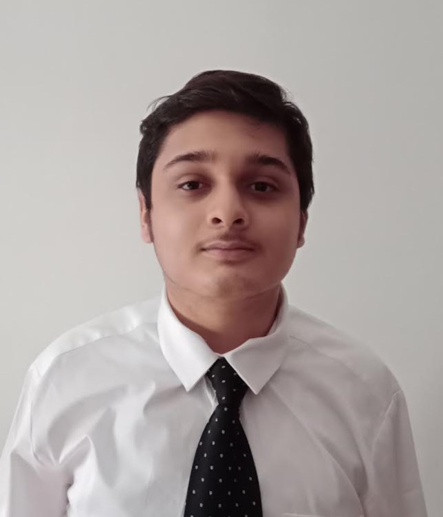

# About Us

We are a team based in the [School of Computing, National University of Singapore](http://www.comp.nus.edu.sg).

You can reach us at the email `seer[at]comp.nus.edu.sg`

## Project team

### Billy Andina

[[homepage](https://github.com/AY2425S2-CS2103T-T10-3/tp)]
[[github](https://github.com/Billy026)]
[[portfolio](team/billyandina.md)]

* Role: Project Advisor

### Nguyen Nhat Minh

[[github](https://github.com/minhkiwi14)]
[[portfolio](team/minh.md)]

* Role: Developer
* Responsibilities: UI

### Kwan Fai Yew

[[github](https://github.com/0xF41)]
[[portfolio](team/kwanfaiyew.md)]

* Role: Developer
* Responsibilities: Data

### Vikram Goyal

[[github](https://github.com/VikramGoyal23)]
[[portfolio](team/vikramgoyal.md)]

* Role: Developer
* Responsibilities: Dev Ops + Threading

### Zayd Mahmud

[[github](https://github.com/ZaydM18)]
[[portfolio](team/zaydmahmud.md)]

* Role: Developer
* Responsibilities: UI
