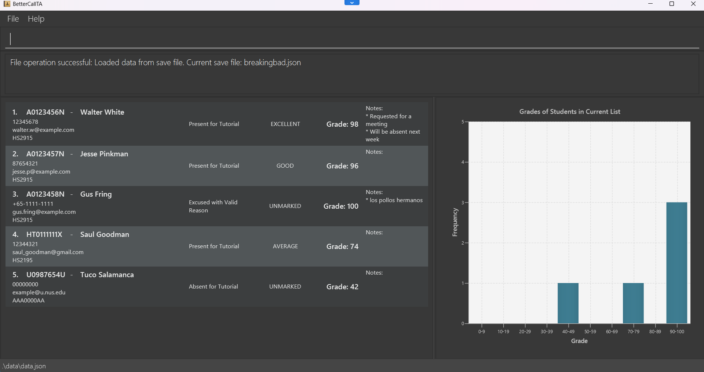
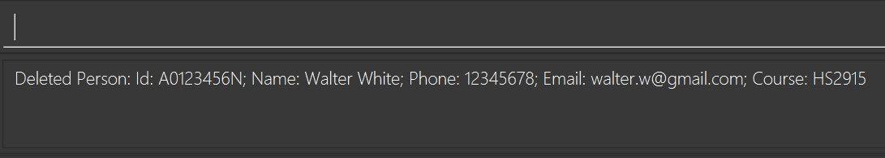
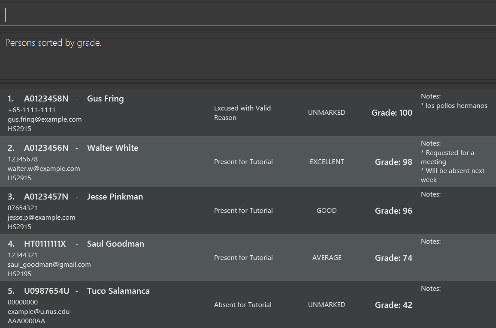
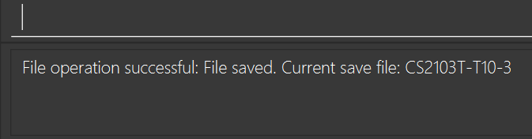
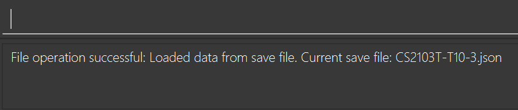
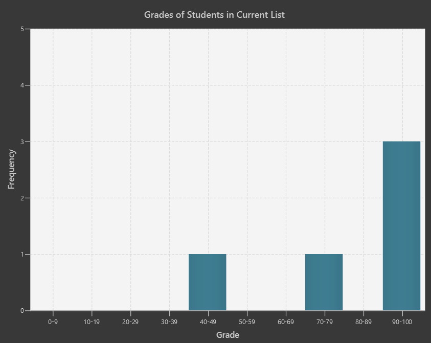

# Better Call TA User Guide
**BetterCallTA** enables Teaching Assistants to **effortlessly manage your students' contacts**. Optimized for use via a **Command Line Interface (CLI)** while still having the benefits of a **Graphical User Interface (GUI)**, **BetterCallTA** handles all the nitty gritty details of your session so that you can focus on **delivering the best to your students**.

---

## Overview
This section covers the overview of **BetterCallTA** application.

### 🎯 Target audience
NUS Teaching Assistants (TA) who can type fast, preferring typing over mouse/voice commands.

### ✨ Value proposition
**Better Call TA** is a **contact management platform** for teaching assistants to manage the details of students in their class(es) as well as **relevant administrative details**, such as their attendance, participation and grades.

### 🤔 Assumptions
- You are familiar with the formats for certain fields in NUS (e.g. NUS Student ID format, Course format)
- You do not have a student who is in your session for two (or more) different courses.

### 📝 Notations
- Angular brackets `< number x '(list of characters) >` means choose `number` from the list of characters, allowing duplicates. For example:
   - <2 x (A/B/C)> means choose two of A, B or C.
   - <(0-2) x (A-Z)> means choose 0 to 2 of any capital letters.

--------------------------------------------------------------------------------------------------------------------

<div style="page-break-after: always;"></div>

## Table of Contents
This section covers the table of contents of our user guide for **BetterCallTA**.

- [Overview](#overview)
  - [🎯 Target audience](#-target-audience)
  - [✨ Value proposition](#-value-proposition)
  - [🤔 Assumptions](#-assumptions)
  - [📝 Notations](#-notations)
- [Quick start](#quick-start)
- [Student](#student)
  - [Properties](#properties)
  - [`ID`-Unique student identifier](#id-unique-student-identifier)
  - [`Name`-Your student name](#name-your-student-name)
  - [`Phone`-Student phone number](#phone-student-phone-number)
  - [`Email`-Student email address](#email-student-email-address)
  - [`Course`-NUS course code](#course-nus-course-code)
  - [`Attendance`-Student class participation status](#attendance-student-class-participation-status)
  - [`Participation`-Student engagement level](#participation-student-engagement-level)
  - [`Grade`-The predicted grade of your student based on their previous graded assignments](#grade-the-predicted-grade-of-your-student-based-on-their-previous-graded-assignments)
  - [`Notes`-Additional details that you may want to keep about individual students](#notes-additional-details-that-you-may-want-to-keep-about-individual-students)
- [Features](#features)
  - [Command Syntax Notes](#command-syntax-notes)
  - [Viewing Help](#viewing-help-help)
  - [Adding a Student](#adding-a-student-add)
  - [Listing All Students](#listing-all-students-list)
  - [Editing a Student](#editing-a-student-edit)
  - [Locating Students by Name, ID or Course](#locating-students-by-name-id-or-course-find)
  - [Sorting Your List](#sorting-your-list-sort)
  - [Deleting a Student](#deleting-a-student-delete)
  - [Saving Contact Data](#saving-contact-data-file-save-filename)
  - [Loading Contact Data](#loading-contact-data-file-load-filename)
  - [Listing Save Files](#listing-save-files-file-list-all)
  - [Clearing All Entries](#clearing-all-entries-clear)
  - [Resetting All Attendance and Participation Records](#resetting-all-attendance-and-participation-records-resetrecords)
  - [Exiting the Program](#exiting-the-program-exit)
- [Additional Features](#additional-features)
  - [Graph Visualisation](#graph-visualisation)
- [FAQ](#faq)
- [Known issues](#known-issues)
- [Command summary](#command-summary)
- [Glossary](#glossary)

--------------------------------------------------------------------------------------------------------------------

## Quick start
This section covers how to get started on using `BetterCallTA`

1. Ensure you have `Java 17` or above installed in your Computer.
   - If you do not have it installed, follow the instructions [here](https://se-education.org/guides/tutorials/javaInstallation.html), selecting your appropriate Operating System (OS).
2. Download the latest `.jar` file from [here](https://github.com/AY2425S2-CS2103T-T10-3/tp/releases).
3. Copy the file to the folder you want to use as the _home folder_ for BetterCallTA.
4. Open a command terminal (refer to the Glossary for a recommended terminal) and use the `cd` command with the folder you put the jar file in.
   - For example,  `cd .\Downloads`
5. Use the `java -jar BetterCallTA.jar` command to run the application.<br>
   - A GUI similar to the one below should appear in a few seconds.

   > 
   <br>Fig 1 - Example User Interface (UI)

6. Type the command in the command box and press Enter ↵ to execute it. e.g. typing **`help`** and pressing Enter will open the help window.


   > Here are some example commands you can try:
   >
   > | Command                                      | Description                                               |
   > |----------------------------------------------|-----------------------------------------------------------|
   > | `add /id A3478231B /name John Doe /phone 98765432 /email johnd@example.com` | Adds a student with the ID `A3478231B` to the application.      |
   > | `edit /id A3478231B /attendance present /participation good /grade 84` | Edits the attendance, participation and grade of the student with ID `A3478231B` to `PRESENT`, `GOOD` and `84` respectively.
   > | `delete /id A1234567B`                       | Deletes the student with ID `A1234567B` in the student list. |
   > | `list`                                       | Lists all students.                                       |
   > | `clear`                                      | Deletes all students.                                     |
   > | `exit`                                       | Exits the app.                                            |

Do refer to the [Features](#features) below for details of each command!

--------------------------------------------------------------------------------------------------------------------

## Student

This section covers the `Student` field used in BetterCallTA, which encapsulates a student contact details in BetterCallTA.

> 
<br>Fig 2.1 - Example Student

<div style="background-color: #fde68a; padding: 10px; border: 1px solid #000; border-radius: 5px; color: #000">
    <b>📝 Note:</b><br>
    All of the attributes <b>apart from student ID</b> can hold duplicate values for different students. So please be careful when addressing other potential conflicts.
</div><br>

---
### Properties

  - [`ID`-Unique student identifier](#id-unique-student-identifier)
  - [`Name`-Your student name](#name-your-student-name)
  - [`Phone`-Student phone number](#phone-student-phone-number)
  - [`Email`-Student email address](#email-student-email-address)
  - [`Course`-NUS course code](#course-nus-course-code)
  - [`Attendance`-Student class participation status](#attendance-student-class-participation-status)
  - [`Participation`-Student engagement level](#participation-student-engagement-level)
  - [`Grade`-The predicted grade of your student based on their previous graded assignments](#grade-the-predicted-grade-of-your-student-based-on-their-previous-graded-assignments)
  - [`Notes`-Additional details that you may want to keep about individual students](#notes-additional-details-that-you-may-want-to-keep-about-individual-students)

---

### `ID`-Unique student identifier

**Format**:
```
<1 x (A/U/HT/NT)> + 7 digits + <1 x (A/B/E/H/J/L/M/N/R/U/W/X/Y)>
```

<div style="background-color: #fde68a; padding: 10px; border: 1px solid #000; border-radius: 5px; color: #000">
    <b>📌 ID Format Rules</b> Follows NUS Student ID format:
    <ul>
      <li>Student ID is <b>case-sensitive</b></li>
      <li>Must start with <code>A</code>, <code>U</code>, <code>HT</code>, or <code>NT</code></li>
      <li>Starting letters must be followed by <b>7 digits</b></li>
      <li>Must end with one of: <code>A, B, E, H, J, L, M, N, R, U, W, X, Y</code></li>
    </ul>
</div><br>

**Examples**:
- `A0738475N`
- `HT0347856U`

---

### `Name`-Your student name

Multiple students with the same name are allowed, as long as they have a unique Student ID.

<div style="background-color: #98fB98; padding: 10px; border: 1px solid #000; border-radius: 5px; color: #000">
    <b>Tips</b>
    <ul>
      <li>All unicode strings are accepted for name. For example,</li>
      <ul>
        <li>陈李 is accepted</li>
        <li>X Æ A-12 Musk is accepted</li>
      </ul>
    </ul>
</div><br>

---

### `Phone`-Student phone number

<div style="background-color: #fde68a; padding: 10px; border: 1px solid #000; border-radius: 5px; color: #000">
    <b>📌 Phone Number Format Rules</b>
    <ul>
      <li>Can start with <code>+</code></li>
      <li>Otherwise, must only contain numbers <code>(0-9)</code> or <code>-</code></li>
      <li>Cannot contain consecutive hyphens</li>
      <li>Cannot start or end with hyphens</li>
      <li>Must be at least 7 digits long and no more than 15 digits long</li>
    </ul>
</div><br>

**Default**: `00000000`

**Example**:
- 86566289
- +65-8576-9485

---

### `Email`-Student email address

**Format**:
```
local-part@domain
```

<div style="background-color: #fde68a; padding: 10px; border: 1px solid #000; border-radius: 5px; color: #000">
    <b>📌 Email Format Rules</b><br>
    <b>Local-Part:</b>
    <ul>
      <li>Only alphanumeric characters <code>(a-z, A-Z, 0-9)</code> and these special characters are also allowed: <code>+</code>, <code>_</code>, <code>.</code>, <code>-</code></li>
      <li>No other symbols are allowed</li>
      <li>Cannot start or end with special characters</li>
    </ul>
    <b>Domain:</b>
    <ul>
      <li>Must end with domain label of at least 2 characters</li>
      <li>Each label must:</li>
      <ul>
            <li>Start and end with alphanumeric characters</li>
            <li>Contain only alphanumerics and periods</li>
      </ul>
    </ul>
    <br>
    <b>Note</b><br>
    This is not a comprehensive list of all the constraints that an email address must satisfy.
</div><br>

**Default**: `example@u.nus.edu`

**Valid Examples**:
- `johndoe@u.nus.edu`
- `example32@gmail.com`

---

### `Course`-NUS course code

**Format**:
```
<(2/3) x (A-Z)> + 4 digits + <(0-2) x (A-Z)>
```

<div style="background-color: #fde68a; padding: 10px; border: 1px solid #000; border-radius: 5px; color: #000">
    <b>📌 Course Format Rules</b>
    <ul>
      <li>Must start with 2 or 3 letters</li>
      <li>Followed by exactly 4 digits</li>
      <li>May optionally end with up to 2 letters</li>
    </ul>
</div><br>

**Default**: `AAA0000AA`

**Valid Examples**:
- `CS2103T`
- `IS1108`
- `MA1101R`

---

### `Attendance`-Student class participation status

| Status      | Description                          | Case Sensitivity |
|-------------|--------------------------------------|------------------|
| `PRESENT` | Present             | Case-insensitive |
| `ABSENT`      | Absent without valid reason          | Case-insensitive |
| `EXCUSED`   | Absent with valid reason             | Case-insensitive |

<div style="background-color: #fde68a; padding: 10px; border: 1px solid #000; border-radius: 5px; color: #000">
    <b>📌 Attendance Format Rules</b>
    <ul>
      <li>Only the above status values are valid</li>
      <li>Matches must be exact (e.g., "Absent" not "Absent again")</li>
      <li>Input can be in any capitalization (e.g., "Present" or "PRESENT")</li>
    </ul>
</div><br>

**Default**: `UNMARKED`

---

### `Participation`-Student engagement level

| Status      | Description                          | Case Sensitivity |
|-------------|--------------------------------------|------------------|
| `EXCELLENT` | Outstanding contribution             | Case-insensitive |
| `GOOD`      | Above average participation          | Case-insensitive |
| `AVERAGE`   | Meets basic expectations             | Case-insensitive |
| `POOR`      | Minimal or insufficient engagement   | Case-insensitive |
| `NONE`      | No observable participation          | Case-insensitive |

<div style="background-color: #fde68a; padding: 10px; border: 1px solid #000; border-radius: 5px; color: #000">
    <b>📌 Participation Format Rules</b>
    <ul>
      <li>Only the above status values are valid</li>
      <li>Matches must be exact (e.g., "Good" not "Good enough")</li>
      <li>Input can be in any capitalization (e.g., "Excellent" or "EXCELLENT")</li>
    </ul>
</div><br>


**Default**: `UNMARKED`

---

### `Grade`-The predicted grade of your student based on their previous graded assignments

<div style="background-color: #fde68a; padding: 10px; border: 1px solid #000; border-radius: 5px; color: #000">
    <b>📌 Grade Format Rules</b>
    <ul>
      <li>You can only enter an integer from <code>0</code> to <code>100</code> (inclusive), or <code>NA</code> (case insensitive)</li>
    </ul>
</div><br>

---

### `Notes`-Additional details that you may want to keep about individual students

- You can attach any number of notes to each student.
- If a student has multiple notes, for example `NOTE 1` and `NOTE 2`, it will be displayed as `[NOTE 1, NOTE 2]` in the command output window.

> 
<br>Fig 2.2 - Output of adding multiple notes to a student

--------------------------------------------------------------------------------------------------------------------

## Features
This section covers all the features of BetterCallTA. Navigate to the following sections to know more about BetterCallTA features.

  - [Command Syntax Notes](#command-syntax-notes)
  - [Viewing Help](#viewing-help-help)
  - [Adding a Student](#adding-a-student-add)
  - [Listing All Students](#listing-all-students-list)
  - [Editing a Student](#editing-a-student-edit)
  - [Locating Students by Name, ID or Course](#locating-students-by-name-id-or-course-find)
  - [Sorting Your List](#sorting-your-list-sort)
  - [Deleting a Student](#deleting-a-student-delete)
  - [Saving Contact Data](#saving-contact-data-file-save-filename)
  - [Loading Contact Data](#loading-contact-data-file-load-filename)
  - [Listing Save Files](#listing-save-files-file-list-all)
  - [Clearing All Entries](#clearing-all-entries-clear)
  - [Resetting All Attendance and Participation Records](#resetting-all-attendance-and-participation-records-resetrecords)
  - [Exiting the Program](#exiting-the-program-exit)

---

### Command Syntax Notes
This section covers the Command Syntax Notes you should be aware of when you are using BetterCallTA.


**Command Syntax Notation**

| Notation               | Meaning                                                                 | Example                                                           |
|------------------------|-------------------------------------------------------------------------|-------------------------------------------------------------------|
| `UPPER_CASE`           | Required parameters you must provide                                    | `add /id ID` → `add /id A1234567X`                                |
| `[square brackets]`    | Optional parameters                                                    | `add /name NAME [/phone PHONE_NUMBER]` → Can omit the /phone part |
| `...` (ellipsis)       | Parameter can be repeated multiple times                               | `/note NOTE...` → Can add multiple notes                          |


**Command Syntax Rules**

| Rule                      | Description                                                                 | Example                                                                 |
|---------------------------|-----------------------------------------------------------------------------|-------------------------------------------------------------------------|
| Parameter Order           | Parameters can be in any order                                              | `add /id A123 /name John` = `add /name John /id A123`                  |
| Extraneous Parameters     | Extra parameters are ignored for simple commands                            | `help 123` → Treated as `help`                                         |
| PDF Copy-Paste Warning    | Watch for missing spaces when copying from PDFs                             | Ensure `/idA123` becomes `/id A123` when pasting                       |


**✨ Recommended Best Practices for Command Syntax**

1.  **✅ Required Parameters**
    * Must always be provided for commands that require them.
    * Example: `ID` in `delete /id ID`

2.  **❓ Optional Parameters**
    * Can be omitted if not needed.
    * Example: Phone number in contact creation.

3.  **➕ Repeated Parameters**
    * Can add multiple instances where supported.
    * Example: Multiple notes for a student.

4.  **✂️ Format Preservation**
    * Maintain exact spacing when copying commands.
    * Test commands after pasting from external sources.


---

### Viewing Help: `help`

Shows a message explaining how to access the help page.

**Format**:
```
help
```

> 
<br>Fig 3.1 - Pop-Up window from entering `help` command

---

### Adding a Student: `add`

Adds a student to the application.

**Format**:
```
add /id ID /name NAME [/phone PHONE_NUMBER] [/email EMAIL] [/course COURSE] [/note NOTE...]
```

**Examples**:
- `add /id A4235352H /name John Doe /phone 98765432 /email johnd@example.com /note Consistently late`
- `add /id A4045018Y /name Betsy Crowe /email betsycrowe@example.com /phone 1234567 /course CS4215`

<div style="background-color: #98fB98; padding: 10px; border: 1px solid #000; border-radius: 5px; color: #000">
    <b>Tips</b>
    <ul>
      <li>If phone, email, course or note are not specified, their default values will be used instead. They can manually be changed by the <code>Edit</code> command.</li>
    </ul>
</div><br>

<br>

> 
<br>Fig 3.2 - Output of
<br>`add /id A4235352H /name John Doe /phone 98765432 /email johnd@example.com /note Consistently late`

---

### Editing a Student: `edit`

Edits an existing student in the application.

**Format**:
```
edit /id ID [/newid NEW_ID] [/name NAME] [/phone PHONE_NUMBER] [/email EMAIL]
[/course COURSE] [/attendance ATTENDANCE] [/participation PARTICIPATION] [/grade GRADE] [/note NOTE…]
```

**Notes**:
- Edits the student with the specified `ID`.
- Only the specified properties will be updated. Other properties will remain as they were previously.

<div style="background-color: #fde68a; padding: 10px; border: 1px solid #000; border-radius: 5px; color: #000">
    <b>Warning</b>
    <ul>
      <li>At least one optional field must be provided</li>
      <li>Not more than one of each optional field should be provided</li>
      <li>The new ID must not already be used by a different student</li>
    </ul>
</div><br>

**Example**:
`edit /id A0123456N /phone 91234567 /email johndoe@example.com`<br><br>
This will update the phone number and email of the student with ID `A0123456N` to `91234567` and `johndoe@example.com` respectively.

<br>

> 
<br>Fig 3.4 - Output of
<br>`edit /id A0123456N /phone 91234567 /email johndoe@example.com`

---

### Deleting a Student: `delete`

Deletes the specified student from the application.

**Format**:
```
delete /id ID
```

* Deletes the student with the specified `ID`.
* The ID refers to the ID belonging to the student in the student list.

**Examples**:
- `delete /id A1234567N` deletes the student with ID `A1234567N`.
- `delete /id A7654321B` deletes the student with ID `A7654321B`.

<br>

> 
<br> Fig 3.7 - Output of `delete /id A1234567N`

---

### Clearing All Entries: `clear`

Clears all entries from the application.

**Format**:
```
clear
```

If there are no students in BetterCallTA, an error message will be shown.

<div style="background-color: #dc3545; padding: 10px; border: 1px solid #000; border-radius: 5px; color: #FFF">
    <b>Alert!</b><br><br>
    The entire list will be <b>permanently</b> deleted and cannot be recovered, so proceed with caution.
</div><br>

<br>

> 
<br> Fig 3.11 - Output of `clear`

---

### Locating Students by Name, ID or Course: `find`

Finds students whose names, IDs or courses contain any of the given keywords.

**Format**:
```
find KEYWORD [MORE_KEYWORDS]
```

<div style="background-color: #98fB98; padding: 10px; border: 1px solid #000; border-radius: 5px; color: #000">
    <b>Tips</b>
    <ul>
      <li>The search is case-insensitive, e.g <code>hans</code> will match <code>Hans</code></li>
      <li>The order of the keywords does not matter, e.g. <code>Hans Bo</code> will match <code>Bo Hans</code></li>
      <li>Students matching at least one keyword will be returned (i.e. <code>OR</code> search),<br>
      e.g. <code>Hans Bo</code> will return <code>Hans Gruber</code> , <code>Bo Yang</code></li>
      <li>Partial words are also matched e.g. <code>Han</code> will match <code>Hans</code></li>
    </ul>
</div><br>

Examples:
* `find John` returns `john` and `John Doe`
* `find alex david` returns `Alex Yeoh`, `David Li`
* `find A1234` returns students with ID numbers that start with A1234

<br>

  >
  <br>Fig 3.5 - Output of `find alex david`

---

### Sorting Your List: `sort`

Sorts your current list by exactly **one** of four parameters: name, grade, attendance or participation.

**Format**:
```
sort /by <1 x (name/grade/attendance/participation)>
```

<div style="background-color: #98fB98; padding: 10px; border: 1px solid #000; border-radius: 5px; color: #000">
    <b>Tips</b>
    <ul>
      <li>The keywords are case-insensitive, e.g <code>grade</code> will match <code>Grade</code></li>
      <li>To sort by multiple parameters, you must sort them one command at a time, in any order</li>
      <li>The sort order for each keyword is as follows (name: special characters first, then numerical digits from 0 to 9, then Aa to Zz | grade: 100 to 0 | attendance: Present > Excused > Absent > Unmarked | Participation: Excellent to Unmarked)</li>
</ul> 
</div><br>

<div style="background-color: #fde68a; padding: 10px; border: 1px solid #000; border-radius: 5px; color: #000">
    <b>Warning</b>
    <ul>
      <li>Exactly one field must be provided</li>
      <li>The list will not automatically sort if you add more people or change student parameters. You must apply the sort again.</li>
    </ul>
</div><br>

Examples:
* `sort /by name` will arrange your list in alphabetical order.
* `sort /by grade` will arrange your students by their grade scores in descending order.

<br>

> 
<br> Fig 3.6 - Output of `sort /by grade`

---

### Listing All Students: `list`

Shows a list of all students in the application.


**Format**:
```
list
```

<br>

> 
<br>Fig 3.3 - Output of `list`

---

### Saving Contact Data: `file /save FILENAME`

BetterCallTA data is automatically saved to `addressbook.json` in `[JAR file location]/data/` by default unless the save file is modified with the `file /load` command.

Change the save file that the application will store data to with `file /save`.

**Format**
```
file /save SAVE_FILE
```

* Modify the save file location as specified with `SAVE_FILE` in `[JAR file location]/data/` as `SAVE_FILE.json`.

**Examples**:
- `file /save CS2103T-T10-3`

<div style="background-color: #dc3545; padding: 10px; border: 1px solid #000; border-radius: 5px; color: #FFF">
    <b>Alert!</b>
    <ul>
      <li>
        You do NOT need to specify the <code>.json</code> file extension as it will automatically be added by our application. If you attempt to include the file extension type <code>SAVE_FILE</code>, such as <code>save.json</code>, an error message will be shown.
      </li>
      <li>
        Only alphanumeric characters and the following symbols are allowed: <code>-</code>, <code>_</code>, <code>(</code>, <code>)</code>. All other symbols are not allowed.
      </li>
      <li>
        If <code>SAVE_FILE.json</code> already exists in the <code>data</code> directory, it will be overwritten.
      </li>
      <li>
        It is recommended NOT to modify the saved <code>SAVE_FILE.json</code> directly as it may introduce unintended behaviour in the application.
      </li>
    </ul>
</div><br>

<br>

> 
<br> Fig 3.8 - Output of `file /save CS2103T-T10-3`

---

### Loading Contact Data: `file /load FILENAME`

BetterCallTA data will load the most recent save file that was used in the application by default. Save files can be loaded with the `file /load` command.

Change the `.json` save file that the application will read/save from with `file /load`.

**Format**
```
file /load SAVE_FILE
```

* Load the specified save file `[JAR file location]/data/SAVE_FILE.json` to the current working application. Subsequent operations will be saved to the loaded `SAVE_FILE.json` file.

**Examples**:
- `file /load CS2103T-T10-3`

<div style="background-color: #fde68a; padding: 10px; border: 1px solid #000; border-radius: 5px; color: #000">
    <b>Warning</b>
    <ul>
      <li>If the save file you attempt to load contains illegal characters, it will not be loaded</li>
    </ul>
</div><br>

<br>

> 
<br> Fig 3.9 - Output of `file /load CS2103T-T10-3`

---

### Listing Save Files: `file /list all`

BetterCallTA stores all save files in `[JAR file location]/data/` and the `file /list all` command will list out all `.json` save files in that directory (without the file extension type), as well as indicating the current save file that is being in use by the application as indicated by `(current save file)`.

**Format**
```
file /list all
```

Lists out all the `.json` save file filenames (without the file extension type) stored by the application in the `/data/*` directory.

**Examples**:
- `file /list all`

---

### Clearing All Entries: `clear`

Clears all entries from the application.

**Format**:
```
clear
```

<br>

> 
<br> Fig 3.10 - Output of `file /list all`
<br> * Actual output may be different depending on what files are in `[JAR file location]/data/`

---

### Resetting All Attendance and Participation Records: `resetRecords`

Resets the attendance and participation status of all students to `UNMARKED`.

**Format**
```
resetRecords
```

<div style="background-color: #fde68a; padding: 10px; border: 1px solid #000; border-radius: 5px; color: #000">
    <b>Warning</b>
    <ul>
      <li>If there are no students in BetterCallTA, or all students have their attendance and participation status <code>UNMARKED</code>, an error message will be shown. </li>
    </ul>
</div><br>

<br>

> 
<br> Fig 3.12 - Output of `resetRecords`

---

### Exiting the Program: `exit`

Exits the program.

**Format**:
```
exit
```

---

<br>

<div style="background-color: #dc3545; padding: 10px; border: 1px solid #000; border-radius: 5px; color: #FFF">
    <b>⚠️ Warning for Advanced Users</b>
    You can update the data directly by editing the file, but be cautious.
    <br><br>
    <ul>
      <li>Saving the application data with the <code>file /save FILE</code> command will overwrite the <code>FILE.json</code> save file if it already exists</li>
      <li>Manually editing the <code>.json</code> file can introduce syntax errors, rendering the file unreadable by BetterCallTA. <b>Validate your <code>.json</code> syntax using a JSON linter before attempting to load it.</b></li>
    </ul>
</div><br>

--------------------------------------------------------------------------------------------------------------------

## Additional Features

### Graph Visualisation

A histogram that shows the grades of all students in the current list.<br>

Automatically updates when a grade is changed.

<div style="background-color: #98fB98; padding: 10px; border: 1px solid #000; border-radius: 5px; color: #000">
    <b>Tips</b>
    <ul>
      <li>Grades with the value <code>NA</code> will be ignored by the histogram</li>
      <li>Divider between list and histogram can be dragged to resize the widths of both sections.</li>
</ul>
</div>

<br>

> 
<br> Fig 4 - Example of a populated graph

--------------------------------------------------------------------------------------------------------------------

## FAQ
This section covers some common questions that BetterCallTA users face.

**Q**: How do I transfer my data to another Computer 💻?<br>
**A**: Copy the save files stored in `[home folder]/data/` over to the new Computer `[home folder]/data/` location.

**Q**: Can I sort students by multiple criteria (e.g., sort by grade, then by name)?<br>
**A**: The `sort` command only supports sorting by one criterion at a time. To sort by multiple parameters, you must use separate sort commands for each.

**Q**: How do I know the correct format for student IDs?<br>
**A**: Student IDs must follow the NUS student ID format: `<1 x (A/U/HT/NT)> + 7 digits + <1 x (A/B/E/H/J/L/M/N/R/U/W/X/Y)>`.

**Q**: Does BetterCallTA support international phone number formats?<br>
**A**: Yes, BetterCallTA supports phone numbers starting with a `+` and allows hyphens, as long as the length is between 7 and 15 digits.

**Q**: If I edit a student, and leave some fields blank, what happens?<br>
**A**: If you edit a student, and only specify some fields, the other fields will remain as they were before the edit.

**Q**: What happens if I accidentally delete a student?<br>
**A**: Deleted students are removed permanently. BetterCallTA does not have an undo function. Regularly backing up your save files is recommended.

**Q**: Why are command words not case-insensitive?<br>
**A**: Command words are case-sensitive as we expect you TAs to not want to waste time capitalising the command word. For the same reason, prefixes are also case-sensitive. However, the parameters are case-insensitive as we understand different users have different ways of entering certain fields.

**Q**: Can I add a student without an email address?<br>
**A**: Yes, the email field is optional.

**Q**: Is there a limit to the number of students I can add?<br>
**A**: There is no hard limit, but performance may degrade with a very large number of students.

--------------------------------------------------------------------------------------------------------------------

## Known issues
This section covers the current known issues with BetterCallTA.

1.  **Multi-Screen Issue**:
<br> When using multiple screens, if you move the application to a secondary screen, and later switch to using only the primary screen, the GUI will open off-screen. The remedy is to delete the `preferences.json` file created by the application before running the application again.

2.  **Minimized Help Window Issue**:
<br> If you minimize the Help Window and then run the `help` command (or use the `Help` menu, or the keyboard shortcut `F1`) again, the original Help Window will remain minimized, and no new Help Window will appear. The remedy is to manually restore the minimized Help Window.

3. **Save File Corruption**:
<br> In the event of an unexpected application crash or system failure during a save operation, the save file (`.json`) may become corrupted. Regularly backup your save files. If a file is corrupted, restore from a backup.

--------------------------------------------------------------------------------------------------------------------

## Command summary
This section covers the summary of commands in BetterCallTA.


Action | Format | Examples
------- | -------- | --------
**Show Usage** | `help` | (None)
**Add** | `add /id ID /name NAME [/phone PHONE_NUMBER] [/email EMAIL] [/course COURSE] [/note NOTE…​]` | `add /id A0123456E /name James Ho /phone 22224444 /email jamesho@example.com`
**Delete** | `delete /id ID` | `delete /id A3456712E`
**Edit** | `edit /id ID [/newid NEW_ID] [/name NAME] [/phone PHONE_NUMBER] [/email EMAIL] [/course COURSE] [/attendance ATTENDANCE] [/participation PARTICIPATION] [/grade GRADE] [/note NOTE…]​` | `edit /id A0123456N /phone 91234567 /email johndoe@example.com`
**Clear** | `clear` | (None)
**Find** | `find KEYWORD [MORE_KEYWORDS]` | `find James Jake`
**Sort** | `sort /by KEYWORD [name/grade/attendance/participation]` | `sort /by name`
**List all users** | `list` | (None)
**Save Data** | `file /save SAVE_FILE` | `file /save CS2103T-T10-3`
**Load Data** | `file /load SAVE_FILE` | `file /load CS2103T-T10-3`
**List Save Files** | `file /list all` | (None)
**Reset Attendance and Participation Records** | `resetRecords` | (None)

--------------------------------------------------------------------------------------------------------------------

## Glossary
This section covers the glossary of key terms as discussed in this User Guide and in other BetterCallTA documentation.

| Term | Definition |
|------|------------|
| **TA** | Teaching Assistant - Supports the instructor in teaching a course by conducting tutorials, grading assignments, and assisting students |
| **CLI** | Command Line Interface - Text-based interface for interacting with software |
| **GUI** | Graphical User Interface - Visual interface with graphical elements |
| **NUS** | National University of Singapore - Institution where this system is primarily used |
| **ID** | Student Identification Number - Unique identifier following NUS format |
| **Home folder** | The folder in your file system that serves as your personal storage space |
| **Command terminal** | **Powershell** on Windows, **Terminal** on Mac and Linux
| **Unicode** | A **text encoding standard** maintained by the Unicode Consortium designed to support the use of text in all of the world writing systems that can be digitized. |
