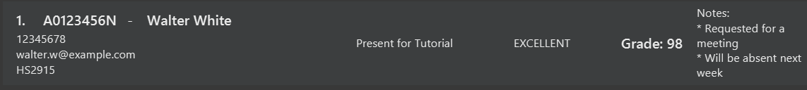

# Better Call TA User Guide

**BetterCallTA** is a **desktop app for managing contacts, optimized for use via a  Line Interface** (CLI) while still having the benefits of a Graphical User Interface (GUI). If you can type fast, BetterCallTA can get your contact management tasks done faster than traditional GUI apps.

## Table of Contents

1. [Quick start](#quick-start)
2. [Features](#features)
   - [Viewing help: `help`](#viewing-help-help)
   - [Adding a person: `add`](#adding-a-person-add)
   - [Listing all persons : `list`](#listing-all-persons--list)
   - [Editing a person : `edit`](#editing-a-person-edit)
   - [Locating persons by name: `find`](#locating-persons-by-name-find)
   - [Deleting a person : `delete`](#deleting-a-person--delete)
   - [Clearing all entries : `clear`](#clearing-all-entries--clear)
   - [Exiting the program : `exit`](#exiting-the-program--exit)
3. [Saving the data](#saving-the-data)
4. [Editing the data file](#editing-the-data-file)
5. [Archiving data files `[coming in v2.0]`](#archiving-data-files-coming-in-v20)
6. [FAQ](#faq)
7. [Known issues](#known-issues)
8. [Command summary](#command-summary)
9. [Glossary](#glossary)

--------------------------------------------------------------------------------------------------------------------

## Quick start

1. Ensure you have Java `17` or above installed in your Computer.<br>

1. Download the latest `.jar` file from [here]([https://github.com/se-edu/addressbook-level3/releases](https://github.com/AY2425S2-CS2103T-T10-3/tp/releases)).

1. Copy the file to the folder you want to use as the _home folder_ for BetterCallTA.

1. Open a command terminal, `cd` into the folder you put the jar file in, and use the `java -jar addressbook.jar` command to run the application.<br>
   A GUI similar to the below should appear in a few seconds. Note how the app contains some sample data.<br>
   

1. Type the command in the command box and press Enter to execute it. e.g. typing **`help`** and pressing Enter will open the help window.<br>
   Some example commands you can try:

| Command                                      | Description                                               |
|----------------------------------------------|-----------------------------------------------------------|
| `list`                                       | Lists all contacts.                                       |
| `add /id A3478231B /name John Doe /phone 98765432 /email johnd@example.com` | Adds a contact named `John Doe` to the Address Book.      |
| `delete /id A1234567B`                       | Deletes the contact with ID `A1234567B` in the current list. |
| `clear`                                      | Deletes all contacts.                                     |
| `exit`                                       | Exits the app.                                            |

1. Refer to the [Features](#features) below for details of each command.

--------------------------------------------------------------------------------------------------------------------

## Person



<box type="info" seamless>

### **Properties**<br>

#### 🆔 **ID** - Unique student identifier

**Format**:
```
[A/U/HT/NT] + 7 digits + [A,B,E,H,J,L,M,N,R,U,W,X,Y]
```

> **📌 ID Format Rules**  
> Follows NUS Student ID format:
> 1. Must start with `A`, `U`, `HT`, or `NT`
> 2. Starting letters must be followed by **7 digits**
> 3. Must end with one of:  
>    `A, B, E, H, J, L, M, N, R, U, W, X, Y`

**Examples**:
- `A0738475N`
- `HT0347856U`

--------

#### `Name` - Your student's name

Duplicate names are allowed, as that is something that **can** happen!

--------

#### 📞 **Phone** - Student's phone number

**Format Rules**:  
1. Must only contain numbers (0-9)  
2. Must be at least 3 digits long  

**Default**: `00000000`  

**Example**:  
- 86566289

--------

#### 📧 **Email** - Student's email address

**Format**: `local-part@domain`  
**Requirements**:

**Local-part**:
- Only alphanumeric characters (a-z, A-Z, 0-9)
- Cannot contain these special characters: `+`, `_`, `.`, `-`
- Cannot start or end with special characters

**Domain**:
- Must end with domain label of at least 2 characters
- Each label must:
  - Start and end with alphanumeric characters
  - Contain only alphanumerics and hyphens

**Default**: `studentname@u.nus.edu`

**Valid Examples**:
- `johndoe@u.nus.edu`
- `example32@gmail.com`

___
#### 🎓 **Course** - NUS course code

**Format Rules**:
1. Must start with 2 or 3 letters
2. Followed by exactly 4 digits
3. May optionally end with up to 2 letters

**Pattern**: `[A-Z]{2,3}[0-9]{4}[A-Z]{0,2}`

**Default**: `No course`

**Valid Examples**:
- `CS2103T`
- `IS1108`
- `MA1101R`

---

#### ✅ **Attendance** - Student's class participation status

**Valid Status Values**:
- `PRESENT`
- `ABSENT` 
- `EXCUSED`

**Notes**:
- Case-insensitive (e.g., "Present" or "present" are accepted)
- Must match one of the values exactly

**Default**: `UNMARKED`

---

#### 🗣️ **Participation** - Student's engagement level

| Status      | Description                          | Case Sensitivity |
|-------------|--------------------------------------|------------------|
| `EXCELLENT` | Outstanding contribution             | Case-insensitive |
| `GOOD`      | Above average participation          | Case-insensitive |
| `AVERAGE`   | Meets basic expectations             | Case-insensitive |
| `POOR`      | Minimal or insufficient engagement   | Case-insensitive |
| `NONE`      | No observable participation          | Case-insensitive |

**Key Rules**:
- Only the above status values are valid
- Matches must be exact (e.g., "Good" not "Good enough")
- Input can be in any capitalization (e.g., "Excellent" or "EXCELLENT")

**Default**: `UNMARKED`

---

#### `Grade` - The predicted grade of your student based on their previous graded assignments

-  You can only enter an integer from `0` to `100` (inclusive) for a grade.

---

#### `Notes` - Additional details that you may want to keep about individual students

- You can attach any number of notes to each student.

--------------------------------------------------------------------------------------------------------------------

## Features

### Syntax Notation

| Notation               | Meaning                                                                 | Example                                                                 |
|------------------------|-------------------------------------------------------------------------|-------------------------------------------------------------------------|
| `UPPER_CASE`           | Required parameters you must provide                                    | `add /id ID` → `add /id A1234567X`                                     |
| `[square brackets]`    | Optional parameters                                                    | `add /name NAME [phone]` → Can omit phone                               |
| `...` (ellipsis)       | Parameter can be repeated multiple times                               | `/note NOTE...` → Can add multiple notes                               |

### Key Rules

| Rule                      | Description                                                                 | Example                                                                 |
|---------------------------|-----------------------------------------------------------------------------|-------------------------------------------------------------------------|
| Parameter Order           | Parameters can be in any order                                              | `add /id A123 /name John` = `add /name John /id A123`                  |
| Extraneous Parameters     | Extra parameters are ignored for simple commands                            | `help 123` → Treated as `help`                                         |
| PDF Copy-Paste Warning    | Watch for missing spaces when copying from PDFs                             | Ensure `/idA123` becomes `/id A123` when pasting                       |

### Best Practices

1. **Required Parameters**  
   - Must always be provided for commands that require them
   - Example: `ID` in `delete /id ID`

2. **Optional Parameters**  
   - Can be omitted if not needed
   - Example: Phone number in contact creation

3. **Repeated Parameters**  
   - Can add multiple instances where supported
   - Example: Multiple notes for a student

4. **Format Preservation**  
   - Maintain exact spacing when copying commands
   - Test commands after pasting from external sources

## Commands Overview

### Viewing Help: `help`

Shows a message explaining how to access the help page.

**Format**: `help`


---

### Adding a Person: `add`

Adds a person to the address book.

**Format**:  
`add /id ID /name NAME [/phone PHONE_NUMBER] [/email EMAIL] [/course COURSE]`

**Examples**:
- `add /id A4235352H /name John Doe /phone 98765432 /email johnd@example.com`
- `add /id A4045018Y /name Betsy Crowe /email betsycrowe@example.com /phone 1234567 /course CS4215`

---

### Listing All Persons: `list`

Shows a list of all persons in the address book.

**Format**:  
`list`

---

### Editing a Person: `edit`

Edits an existing person in the address book.

**Format**:  
`edit /id ID [/newid NEW_ID] [/name NAME] [/phone PHONE_NUMBER] [/email EMAIL] [/course COURSE]`

**Notes**:  
- Edits the person with the specified `ID`.
- Only the specified properties will be updated. Other properties will remain as they were previously.

<div style="background-color: #fde68a; padding: 10px; border: 1px solid #000; border-radius: 5px; color: #000">
    <b>Warning</b>
    <ul>
      <li>At least one optional field must be provided</li>
      <li>Not more than one of each optional field should be provided</li>
      <li>The new ID must not already be used by a different person</li>
    </ul>
</div><br>

**Example**:  
`edit /id A0123456N /phone 91234567 /email johndoe@example.com`  
This will update the phone number and email of the person with ID `A0123456N` to `91234567` and `johndoe@example.com` respectively.

---

### Locating Persons by Name: `find`

Finds persons whose names contain any of the given keywords.

**Format**:  
`find KEYWORD [MORE_KEYWORDS]`

<div style="background-color: #98fB98; padding: 10px; border: 1px solid #000; border-radius: 5px; color: #000">
    <b>Tips</b>
    <ul>
      <li>The search is case-insensitive, e.g <code>hans</code> will match <code>Hans</code></li>
      <li>The order of the keywords does not matter, e.g. <code>Hans Bo</code> will match <code>Bo Hans</code></li>
      <li>Persons matching at least one keyword will be returned (i.e. <code>OR</code> search),<br>
      e.g. <code>Hans Bo</code> will return <code>Hans Gruber</code> , <code>Bo Yang</code></li>
    </ul>
</div><br>

<div style="background-color: #fde68a; padding: 10px; border: 1px solid #000; border-radius: 5px; color: #000">
    <b>Warning</b>
    <ul>
      <li>Only the name is searched</li>
      <li>Only full words will be matched e.g. <code>Han</code> will not match <code>Hans</code></li>
    </ul>
</div><br>

Examples:
* `find John` returns `john` and `John Doe`
* `find alex david` returns `Alex Yeoh`, `David Li`

<br>

  

### Deleting a Person: `delete`

Deletes the specified person from the address book.

**Format**:  
`delete /id ID`

* Deletes the person with the specified `ID`.
* The ID refers to the ID belonging to the person in the person list.

**Examples**:
- `delete /id A1234567N` deletes the person with ID `A1234567N`.
- `delete /id A7654321B` deletes the person with ID `A7654321B`.

---

### Clearing All Entries: `clear`

Clears all entries from the address book.

**Format**:  
`clear`

---

### Exiting the Program: `exit`

Exits the program.

**Format**:  
`exit`

---

### Saving the Data

BetterCallTA data is automatically saved to the hard disk after any command that changes the data. There is **no need** to save manually.

---

### Editing the Data File

BetterCallTA data is saved automatically as a JSON file located at:  
`[JAR file location]/data/addressbook.json`

**Warning for Advanced Users**:  
You can update the data directly by editing the file, but be cautious.

#### **Caution**:  
- If your changes make the file's format invalid, BetterCallTA will discard all data and start with an empty file the next time it is run.
- **Backup** the data file before editing it to prevent data loss.
- Incorrect edits could cause unexpected behavior (e.g., invalid values or

### Archiving data files `[coming in v2.0]`

_Details coming soon ..._

--------------------------------------------------------------------------------------------------------------------

## FAQ

**Q**: How do I transfer my data to another Computer?<br>
**A**: Install the app in the other computer and overwrite the empty data file it creates with the file that contains the data of your previous BetterCallTA home folder.

--------------------------------------------------------------------------------------------------------------------

## Known issues

1. **When using multiple screens**, if you move the application to a secondary screen, and later switch to using only the primary screen, the GUI will open off-screen. The remedy is to delete the `preferences.json` file created by the application before running the application again.
2. **If you minimize the Help Window** and then run the `help` command (or use the `Help` menu, or the keyboard shortcut `F1`) again, the original Help Window will remain minimized, and no new Help Window will appear. The remedy is to manually restore the minimized Help Window.

--------------------------------------------------------------------------------------------------------------------

## Command summary

Action     | Format, Examples
-----------|----------------------------------------------------------------------------------------------------------------------------------------------------------------------
**Add**    | `add /id ID /name NAME [/phone PHONE_NUMBER] [/email EMAIL] [/course COURSE]…​` <br> e.g., `add /id A0123456E /name James Ho /phone 22224444 /email jamesho@example.com`
**Clear**  | `clear`
**Delete** | `delete /id ID`<br> e.g., `delete /id A3456712E`
**Edit**   | `edit /id ID [/newid NEW_ID] [/name NAME] [/phone PHONE_NUMBER] [/email EMAIL] [/course COURSE]…​`<br> e.g.,`edit /id A0123456N /phone 91234567 /email johndoe@example.com`
**Find**   | `find KEYWORD [MORE_KEYWORDS]`<br> e.g., `find James Jake`
**List**   | `list`
**Help**   | `help`

--------------------------------------------------------------------------------------------------------------------

## Glossary

`TA` - Teaching Assistant<br>
Assists the instructor in teaching a course.
